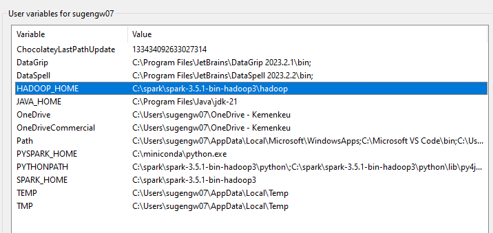
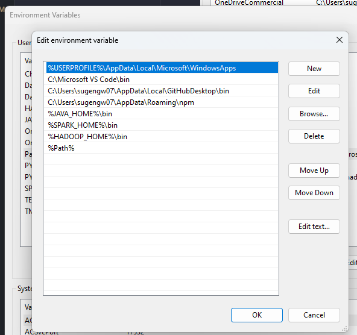
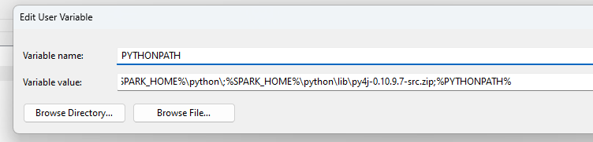

# Install Spark Windows

###### Ada di folder setup, tapi saya mau note garis besar nya biar tidak bingung

1. Download tools and software: JAVA, SPARK, WINUTILS
2. Install java, extrack Spark taruh di lokasi yg mudah dicari misal c:/spark
3. bikin folder hadoop/bin. masukkan winutils di dalamnya. Bisa di dalam spark atau folder baru
4. Tambahkan user variable JAVA_HOME, SPARK_HOME, HADOOP_HOME.
5. Masukkan lokasi masing- masing file, HADOOP_HOME ke tempat winutils
6. Ingat masukkan path nya sampai di folder sebelum masuk bin aja, tidak masuk sampe bin
7. Tambahkan path di env variable, %JAVA_HOME%\bin, %SPARK_HOME%\bin, %HADOOP_HOME%\bin\

###### Buat Pyspark kita harus setting python path

set PYTHONPATH:%SPARK_HOME%\python\;%SPARK_HOME%\python\lib\py4j-0.10.9.7-src.zip;%PYTHONPATH%

