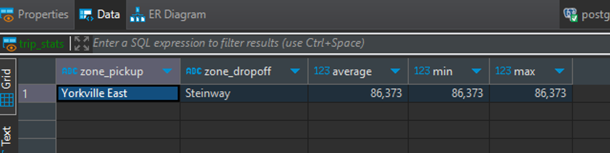
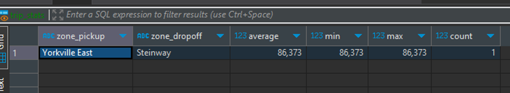
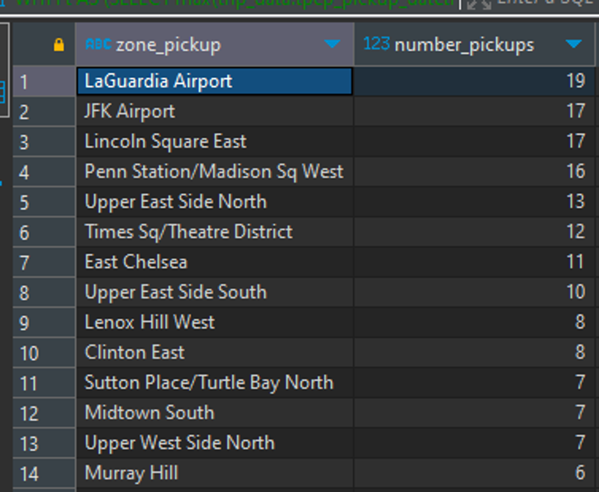

# homework RisingWave

kategori: Workshop

### Question 1

Create a materialized view to compute the average, min and max trip time \***\*between each taxi zone\*\***.From this MV, find the pair of taxi zones with the highest average trip time.

You may need to use the [dynamic filter pattern](https://docs.risingwave.com/docs/current/sql-pattern-dynamic-filters/) for this.

Bonus (no marks): Create an MV which can identify anomalies in the data. For example, if the average trip time between two zones is 1 minute,

but the max trip time is 10 minutes and 20 minutes respectively.

Options:

1. Yorkville East, Steinway
2. Murray Hill, Midwood
3. East Flatbush/Farragut, East Harlem North
4. Midtown Center, University Heights/Morris Heights

p.s. The trip time between taxi zones does not take symmetricity into account, i.e. `A -> B` and `B -> A` are considered different trips. This applies to subsequent questions as well.

### Answer:

```sql

CREATE MATERIALIZED VIEW trip_stats AS

WITH s AS (

    SELECT pulocationid, dolocationid ,

    avg( EXTRACT (EPOCH FROM (tpep_dropoff_datetime-tpep_pickup_datetime) ))AS average

    FROM trip_data

    GROUP BY pulocationid, dolocationid

),

trip_calc AS (

    SELECT

        zone_pickup.zoneAS zone_pickup ,

        zone_dropoff.zoneAS zone_dropoff ,

        avg( EXTRACT (EPOCH FROM (tpep_dropoff_datetime-tpep_pickup_datetime) ))AS average,

        min( EXTRACT (EPOCH FROM (tpep_dropoff_datetime-tpep_pickup_datetime) )) AS min,

        max( EXTRACT (EPOCH FROM (tpep_dropoff_datetime-tpep_pickup_datetime) )) AS max

    FROM trip_data

    JOIN taxi_zone AS zone_pickup ONtrip_data.pulocationid=zone_pickup.location_id

    JOIN taxi_zone AS zone_dropoff ONtrip_data.dolocationid=zone_dropoff.location_id

    GROUP BY

        zone_pickup.zone,

        zone_dropoff.zone

        )

SELECT * FROM trip_calc WHEREtrip_calc.average= (SELECTmax(average) FROM s)

```



### Question 2

Recreate the MV(s) in question 1, to also find the **number of trips** for the pair of taxi zones with the highest average trip time.

Options:

1. 5
2. 3
3. 10
4. 1

```sql

CREATE MATERIALIZED VIEW trip_stats AS

WITH s AS (

    SELECT pulocationid, dolocationid ,

    avg( EXTRACT (EPOCH FROM (tpep_dropoff_datetime-tpep_pickup_datetime) ))AS average

    FROM trip_data

    GROUP BY pulocationid, dolocationid

),

trip_calc AS (

    SELECT

        zone_pickup.zoneAS zone_pickup ,

        zone_dropoff.zoneAS zone_dropoff ,

        avg( EXTRACT (EPOCH FROM (tpep_dropoff_datetime-tpep_pickup_datetime) ))AS average,

        min( EXTRACT (EPOCH FROM (tpep_dropoff_datetime-tpep_pickup_datetime) )) AS min,

        max( EXTRACT (EPOCH FROM (tpep_dropoff_datetime-tpep_pickup_datetime) )) AS max,

        count(*)

    FROM trip_data

    JOIN taxi_zone AS zone_pickup ONtrip_data.pulocationid=zone_pickup.location_id

    JOIN taxi_zone AS zone_dropoff ONtrip_data.dolocationid=zone_dropoff.location_id

    GROUP BY

        zone_pickup.zone,

        zone_dropoff.zone

        )

SELECT * FROM trip_calc WHEREtrip_calc.average= (SELECTmax(average) FROM s)

```



### Question 3

From the latest pickup time to 17 hours before, what are the top 3 busiest zones in terms of number of pickups?

For example if the latest pickup time is 2020-01-01 17:00:00,

then the query should return the top 3 busiest zones from 2020-01-01 00:00:00 to 2020-01-01 17:00:00.

> HINT: You can use [dynamic filter pattern](https://docs.risingwave.com/docs/current/sql-pattern-dynamic-filters/)

to create a filter condition based on the latest pickup time.

NOTE: For this question `17 hours` was picked to ensure we have enough data to work with.

Options:

1. Clinton East, Upper East Side North, Penn Station
2. LaGuardia Airport, Lincoln Square East, JFK Airport
3. Midtown Center, Upper East Side South, Upper East Side North
4. LaGuardia Airport, Midtown Center, Upper East Side North

```sql

WITH t AS (SELECTmax(trip_data.tpep_pickup_datetime)AS max_pickup FROM trip_data)

SELECT

        zone_pickup.zoneAS zone_pickup ,

        count(*)AS number_pickups

    FROM t,trip_data

    JOIN taxi_zone AS zone_pickup ONtrip_data.pulocationid=zone_pickup.location_id

    WHEREtrip_data.tpep_pickup_datetime> (t.max_pickup -INTERVAL '17'HOUR)

    GROUP BY

        zone_pickup.zone

    ORDER BY

        number_pickups DESCNULLSLAST

```


